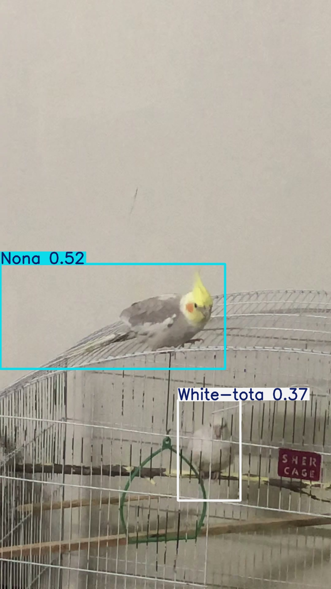

# 🦜 Parrot Detector

A computer-vision system that detects my three pet cockatiels **individually** and labels each one by
name — live on a webcam and as a batch over a folder of images/videos. Everything runs **locally** and
uses **free** tools.

> ✅ **Status: v1 complete** — a working end-to-end pipeline (data → labels → training → evaluation →
> live & batch detection). It's an honest proof-of-concept: it works well on familiar scenes but needs
> more varied data to be reliable everywhere (see _Limitations & future work_). Built as my first
> end-to-end machine learning project.

---

## The problem

I have three cockatiels — **Cookie**, **Nona**, and **White-tota**. They are the *same species* and look
fairly similar, so telling them apart by name is a genuine "fine-grained" recognition challenge. The goal
is a model that can look at a camera feed (or a folder of photos/videos) and draw a labeled box around
each bird with the correct name.

## What it does

- 🎥 **Live mode** (`scripts/detect_live.py`) — reads a webcam *or* a video file and draws each bird's
  name on screen in real time.
- 🗂️ **Batch mode** (`scripts/detect_folder.py`) — runs over a whole folder of images/videos and saves
  labeled copies.
- 💻 **Runs locally** on an NVIDIA GPU; no cloud or paid services required.

## Tech stack

| Tool | What it's for |
| --- | --- |
| **Python 3.12** + **uv** | Language + environment/package manager |
| **Ultralytics YOLO** | The object-detection model (training + detection) |
| **PyTorch (CUDA)** | The engine YOLO runs on, using the GPU |
| **OpenCV** | Reading the webcam and drawing boxes/labels |
| **ffmpeg** | Pulling still frames out of videos |
| **Label Studio** | Drawing the training labels (bounding boxes) by hand |
| **git + GitHub** | Version control and hosting |

## Project structure

```
parrot-detector/
├── data/
│   ├── raw_videos/   # original videos of the birds
│   └── frames/       # still images extracted from the videos
├── scripts/          # Python programs (webcam detection, batch, frame extraction)
├── models/           # trained model files
├── notebooks/        # experiments
├── README.md         # this file
├── PROGRESS.md       # step-by-step progress tracker
└── .gitignore        # files git should ignore
```

## The classes (birds)

| Label | Bird |
| --- | --- |
| `Cookie` | Cookie 🐦 |
| `Nona` | Nona 🐦 |
| `White-tota` | White-tota 🐦 |

## Results

I trained on ~227 hand-labeled frames (split **by recording session** into train/val/test, so the test
set contains entirely unseen clips — an honest measure of generalization).

**Experiments compared** (validation mAP50 — higher is better, max 1.0):

| Experiment | Model | Setup | Overall mAP50 |
| --- | --- | --- | --- |
| A | YOLO11 nano | pretrained (transfer learning) | 0.93 |
| **B** | **YOLO11 small** | **pretrained (transfer learning)** | **0.98** 🏆 |
| C | YOLO11 nano | trained from scratch | 0.70 |

**Takeaways:**
- **Transfer learning matters a lot.** Same nano model, pretrained vs. from scratch: **0.93 vs 0.70**.
- **A bigger model helped the hard case.** The look-alike pair (Cookie/Nona, same colour) is the real
  challenge; the "small" model handled it best, so it's the chosen model.
- **Honest test-set score:** on never-seen clips the winner scored **mAP50 ≈ 0.32** — much lower than the
  validation number. That gap is the model **overfitting** to familiar scenes, and is the reason "more
  varied data" is the main next step. The confusion matrix showed the birds are rarely mistaken for *each
  other*; the main errors are **misses** and **false alarms** on unfamiliar backgrounds.

## Demo



_The detector boxing and naming a bird in a video frame._

## How to run

**Requirements:** Windows + an NVIDIA GPU, [uv](https://docs.astral.sh/uv/) installed.

```powershell
# 1) Create the environment and install dependencies
uv venv --python 3.12
.\.venv\Scripts\Activate.ps1
uv pip install torch torchvision --torch-backend=auto   # GPU PyTorch
uv pip install ultralytics

# 2) Live detection on a video file (or pass --source 0 for a webcam)
python scripts/detect_live.py --source path/to/video.mov

# 3) Batch detection over a folder of images/videos
python scripts/detect_folder.py --source path/to/folder
```

> The trained model (`models/parrot_best.pt`) and the dataset are kept out of git (large files). The
> scripts in `scripts/` document the full pipeline: `split_dataset.py` builds the train/val/test split,
> and the two `detect_*.py` scripts run the model.

## Limitations & future work

This is an honest v1, not a finished product:

- **Generalization gap.** Strong on familiar scenes, weaker on brand-new ones (test mAP50 ≈ 0.32). The
  main fix is **more varied training data** — more clips of each bird in different places, lighting, and
  angles (avoiding the "background trap").
- **Cookie vs. Nona** (same colour) is the hardest pair, as expected for fine-grained recognition.
- **Next steps:** collect a more diverse dataset → re-label → retrain (a "v2"); then re-evaluate on the
  held-out test set to confirm the gap closes.

---

_Built as a learning project, one phase at a time. See `PROGRESS.md` for the current status._
